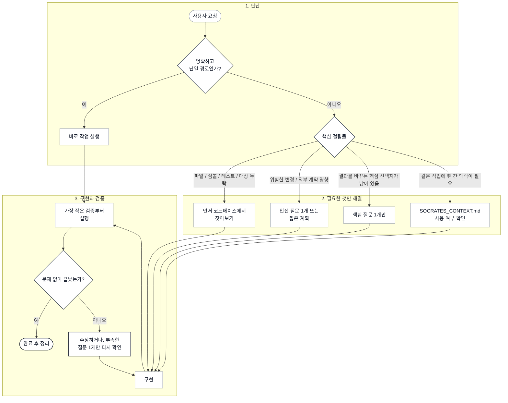

# Socrates Protocol

[](https://github.com/jiyeongjun/socrates-protocol/tags)
[](https://github.com/jiyeongjun/socrates-protocol/actions/workflows/test.yml)
[](./LICENSE)

[English](./README.md)

모호함, 리스크, 구현 분기가 결과를 실제로 바꿀 때 개입하는 코딩 스킬입니다.

## 하는 일

요청이 이미 명확하고 사실상 한 경로로 수렴하면 Socrates는 개입하지 않습니다.
질문이 실제 구현을 바꾸는 경우에만 개입합니다.
같은 작업을 여러 턴에 걸쳐 이어가야 할 정도로 맥락 유지가 필요할 때만 워크스페이스 루트의 `SOCRATES_CONTEXT.md`를 사용합니다.

핵심 동작:

- 명확한 요청: 바로 실행
- 아티팩트나 대상 누락: 먼저 코드베이스에서 찾아보고, 그래도 없으면 질문
- 고위험 미결정 작업: 가장 안전을 좌우하는 질문부터 먼저
- 여러 유효한 구현 분기: 핵심 트레이드오프를 드러내고 방향을 정한 뒤 구현
- 여러 턴에 걸친 맥락 유지 필요: `SOCRATES_CONTEXT.md` 생성 여부를 먼저 질문
- 작업 성공: `SOCRATES_CONTEXT.md` 자동 삭제

주로 이런 경우에 발동합니다:

- `elegant`, `clean`, `good`, `robust` 같은 미정의 선호어
- API, 스키마, 마이그레이션, 인증, 결제, 삭제, 프로덕션 변경
- 여러 구현 방향이 실질적으로 달라질 수 있는 요청
- 환경 변수, 설정 키, 공개 API, 영속 필드 이름 변경
- 같은 작업을 여러 번 오가며 맥락을 이어야 할 가능성이 높은 요청

## 동작 흐름

Socrates는 하나의 라우터 스킬입니다.
질문부터 하는 대신, 가장 가벼우면서도 안전한 경로를 먼저 고릅니다.



짧게 요약하면:

- 명확한 요청: 바로 실행
- 대상 누락: 먼저 찾아보고, 없으면 질문
- 위험한 변경: 안전 결정을 먼저 확인
- 공유 맥락: `SOCRATES_CONTEXT.md` 하나만 사용
- 변경 후: 넓게 돌리기 전에 좁게 검증

## 한계

Socrates는 어떤 모호함이 실제로 구현을 바꾸는지 판단할 때도 결국 LLM 추론에 의존합니다.
즉, 입구 판정 자체가 이 스킬이 안내하는 모델과 같은 기본 한계를 가집니다.

특히 다음 경우에 가장 효과적입니다:

- 고위험 신호가 프롬프트나 코드 맥락에 명시적으로 드러날 때
- 미결정 분기나 누락된 제약이 이미 텍스트로 드러나 있을 때
- 사용자가 몇 개의 구체적인 질문에 짧게 답해 방향을 결정할 수 있을 때
- 같은 작업의 맥락을 여러 턴에 걸쳐 실제로 유지해야 할 때

반대로 다음은 놓칠 수 있습니다:

- 텍스트로 드러나지 않은 미묘한 암묵적 가정
- 프롬프트나 리포지토리에서 보이지 않는 팀 관례나 비즈니스 제약
- 구현을 더 진행해야 비로소 드러나는 모호함

이 스킬은 리스크를 줄이기 위한 보조 장치이지, 구현을 좌우하는 핵심 모호함을 빠짐없이 드러낸다는 보장은 아닙니다.
`SOCRATES_CONTEXT.md`는 사용자와 공유하는 현재 맥락 문서이지 task manager가 아니라는 점도 분명히 둡니다.

## 빠른 설치

아래 예시는 현재 태그 버전인 `v0.3.0`에 고정됩니다.

### Codex

권장 quick install:

```bash
VERSION=v0.3.0 && curl -fsSL https://raw.githubusercontent.com/jiyeongjun/socrates-protocol/$VERSION/scripts/install.mjs | SOCRATES_INSTALL_RUN=1 node --input-type=module - --platform codex --scope global --version "$VERSION" --enable-codex-hooks
```

처음부터 Stop hook까지 포함해서 설치:

```bash
VERSION=v0.3.0 && curl -fsSL https://raw.githubusercontent.com/jiyeongjun/socrates-protocol/$VERSION/scripts/install.mjs | SOCRATES_INSTALL_RUN=1 node --input-type=module - --mode install --platform codex --scope global --version "$VERSION" --feature stop-hook --enable-codex-hooks
```

Codex hook 활성화:

- 위 권장 install 명령은 `~/.codex/config.toml`에 `codex_hooks = true`까지 함께 반영합니다
- 예전에 `--enable-codex-hooks` 없이 설치했다면 스킬 자체는 동작하지만 `SessionStart`와 선택적 `Stop` hook은 이 feature flag를 켜기 전까지 실행되지 않습니다
- 이미 설치한 상태라면 installer를 `--enable-codex-hooks`와 함께 다시 실행하거나, 아래 fallback 명령을 한 번만 실행하면 됩니다:

```bash
mkdir -p ~/.codex && node --input-type=module - <<'EOF'
import { existsSync, mkdirSync, readFileSync, writeFileSync } from "node:fs";
import { homedir } from "node:os";
import path from "node:path";

const configPath = path.join(homedir(), ".codex", "config.toml");
mkdirSync(path.dirname(configPath), { recursive: true });
const existing = existsSync(configPath) ? readFileSync(configPath, "utf8") : "";
const featuresPattern = /^\[features\]\s*$(?:\n(?!\[).*)*/m;

let next = existing;
if (!featuresPattern.test(existing)) {
  next = `${existing.trimEnd()}\n\n[features]\ncodex_hooks = true\n`.trimStart();
} else {
  next = existing.replace(featuresPattern, (section) => {
    if (/^\s*codex_hooks\s*=.*$/m.test(section)) {
      return section.replace(/^\s*codex_hooks\s*=.*$/m, "codex_hooks = true");
    }
    return `${section}\ncodex_hooks = true`;
  });
}

writeFileSync(configPath, next.endsWith("\n") ? next : `${next}\n`, "utf8");
console.log(`Updated ${configPath}`);
EOF
```

업데이트:

- 원하는 버전 태그로 같은 install 명령을 다시 실행하면 됩니다
- installer는 오래된 Socrates 파일은 최신으로 덮어쓰고, 관련 없는 hook 엔트리는 유지하며, hook이 독립 실행되도록 필요한 지원 파일도 함께 설치합니다

제거:

```bash
curl -fsSL https://raw.githubusercontent.com/jiyeongjun/socrates-protocol/v0.3.0/scripts/install.mjs | SOCRATES_INSTALL_RUN=1 node --input-type=module - --mode uninstall --platform codex --scope global
```

리포지토리에 설치:

```bash
VERSION=v0.3.0 && TARGET_REPO=/absolute/path/to/your/repo && curl -fsSL https://raw.githubusercontent.com/jiyeongjun/socrates-protocol/$VERSION/scripts/install.mjs | SOCRATES_INSTALL_RUN=1 node --input-type=module - --platform codex --scope repo --target-repo "$TARGET_REPO" --version "$VERSION" --enable-codex-hooks
```

명시적 호출 예시:

```text
$socrates 프로덕션 SaaS용 계정 삭제 API를 설계해줘. GDPR도 맞춰야 하고 안전해야 해.
```

자동 개입 예시:

```text
프로덕션 SaaS용 계정 삭제 API를 설계해줘. GDPR도 맞춰야 하고 안전해야 해.
```

Codex/OpenAI 참고:

- 생성되는 agent 메타데이터는 호스트가 지원할 때 implicit invocation을 켜 둡니다
- 다만 스킬을 확실히 강제하고 싶다면 여전히 명시적 `$socrates` 호출이 가장 확실합니다

선택적 Codex hook:

- 이 저장소에는 보수적으로 동작하는 repo-local hook인 `.codex/hooks.json`도 포함되어 있습니다
- 이 hook은 `SessionStart`에서만 실행되고 `SOCRATES_CONTEXT.md`가 이미 있을 때만 컨텍스트를 추가합니다
- 즉, 빠른 경로 작업은 건드리지 않고 여러 턴에 걸친 Socrates 작업을 다시 열었을 때만 도움이 되도록 설계했습니다
- Codex hook은 스킬별 활성화가 아니라 `hooks.json` 레이어 기준으로 로드되므로, 이 hook 파일도 repo hook layer가 활성화되어 있으면 로드됩니다
- 그래서 포함된 hook 스크립트는 `SOCRATES_CONTEXT.md`를 찾지 못하면 아무것도 하지 않도록 구현되어 있습니다
- 탐색은 가장 가까운 git root까지만 올라가므로, nested repo가 상위 repo의 `SOCRATES_CONTEXT.md`를 잘못 집는 일은 막습니다
- 위 quick install 명령은 Socrates 라우터 스킬, 미러된 `references/` 파일들, 그리고 Socrates `SessionStart` hook을 함께 설치하고, 기존 `hooks.json`과 병합합니다
- 위 권장 Codex install 명령은 필요한 `codex_hooks = true` feature flag까지 함께 켭니다

선택적 Stop hook:

- 기본 설치에는 `Stop` hook이 포함되지 않습니다
- `SOCRATES_CONTEXT.md`가 `clarifying` 상태일 때 Socrates가 한 번 더 역질문 턴을 밀어주길 원할 때만 별도로 설치하세요
- 이 hook은 `SessionStart`보다 강합니다. 단순히 맥락을 복구하는 것이 아니라 턴을 한 번 더 이어갈 수 있습니다
- hook은 스킬 스코프가 아니라 설정 스코프이므로, 마지막 assistant 메시지가 현재 clarifying task와 충분히 겹치면 같은 repo의 비-Socrates 작업에도 영향을 줄 수 있습니다
- 포함된 구현은 보수적으로 동작합니다. canonical `SOCRATES_CONTEXT.md`, `status: "clarifying"`, 남아 있는 `next_question`, 그리고 마지막 assistant 메시지와의 관련성이 모두 있어야만 개입합니다

선택적 Codex Stop hook 설치:

```bash
VERSION=v0.3.0 && curl -fsSL https://raw.githubusercontent.com/jiyeongjun/socrates-protocol/$VERSION/scripts/install.mjs | SOCRATES_INSTALL_RUN=1 node --input-type=module - --mode install --platform codex --scope global --version "$VERSION" --feature stop-hook --enable-codex-hooks
```

선택적 Codex Stop hook만 제거:

```bash
curl -fsSL https://raw.githubusercontent.com/jiyeongjun/socrates-protocol/v0.3.0/scripts/install.mjs | SOCRATES_INSTALL_RUN=1 node --input-type=module - --mode uninstall --platform codex --scope global --feature stop-hook
```

### Claude Code

권장 quick install:

```bash
VERSION=v0.3.0 && curl -fsSL https://raw.githubusercontent.com/jiyeongjun/socrates-protocol/$VERSION/scripts/install.mjs | SOCRATES_INSTALL_RUN=1 node --input-type=module - --platform claude --scope global --version "$VERSION"
```

처음부터 Stop hook까지 포함해서 설치:

```bash
VERSION=v0.3.0 && curl -fsSL https://raw.githubusercontent.com/jiyeongjun/socrates-protocol/$VERSION/scripts/install.mjs | SOCRATES_INSTALL_RUN=1 node --input-type=module - --mode install --platform claude --scope global --version "$VERSION" --feature stop-hook
```

Claude hook 동작:

- 위 권장 install 명령은 Socrates 라우터 스킬, 미러된 `references/` 파일들, `.claude/agents/` 아래의 Claude 전용 subagent들, 그리고 보수적인 `SessionStart` hook을 함께 설치합니다
- 기본 설치에는 더 강하게 개입하는 `Stop` hook이 포함되지 않습니다
- 바로 위 두 번째 명령은 그 `Stop` hook까지 처음부터 같이 설치합니다

업데이트:

- 원하는 버전 태그로 같은 install 명령을 다시 실행하면 됩니다
- installer는 오래된 Socrates 파일은 최신으로 덮어쓰고, 관련 없는 settings는 유지하며, hook이 독립 실행되도록 필요한 지원 파일도 함께 설치합니다

제거:

```bash
curl -fsSL https://raw.githubusercontent.com/jiyeongjun/socrates-protocol/v0.3.0/scripts/install.mjs | SOCRATES_INSTALL_RUN=1 node --input-type=module - --mode uninstall --platform claude --scope global
```

리포지토리에 설치:

```bash
VERSION=v0.3.0 && TARGET_REPO=/absolute/path/to/your/repo && curl -fsSL https://raw.githubusercontent.com/jiyeongjun/socrates-protocol/$VERSION/scripts/install.mjs | SOCRATES_INSTALL_RUN=1 node --input-type=module - --platform claude --scope repo --target-repo "$TARGET_REPO" --version "$VERSION"
```

명시적 호출 예시:

```text
/socrates 프로덕션 SaaS용 계정 삭제 API를 설계해줘. GDPR도 맞춰야 하고 안전해야 해.
```

자동 개입 예시:

```text
프로덕션 SaaS용 계정 삭제 API를 설계해줘. GDPR도 맞춰야 하고 안전해야 해.
```

Claude 참고:

- 스킬 경로: `.claude/skills/<skill-name>/SKILL.md`
- Claude 전용 Socrates subagent 경로: `.claude/agents/socrates-explore.md`, `.claude/agents/socrates-plan.md`, `.claude/agents/socrates-verify.md`
- 세부 on-demand 가이드는 `.claude/skills/socrates/references/` 아래 한 단계 깊이에 위치합니다
- 현재 버전은 `/socrates` 수동 호출과 관련 맥락에서의 auto-load를 둘 다 지원합니다
- 이 저장소에는 보수적으로 동작하는 프로젝트 hook 설정인 `.claude/settings.json`도 포함되어 있습니다
- 이 hook은 `SessionStart`에서만 실행되고 `SOCRATES_CONTEXT.md`가 이미 있을 때만 컨텍스트를 추가합니다
- Claude hook도 스킬별 활성화가 아니라 settings layer 기준으로 로드되므로, 포함된 hook은 공유 맥락 문서를 찾지 못하면 아무 일도 하지 않도록 만들었습니다
- 탐색은 가장 가까운 git root까지만 올라가므로, nested repo가 상위 repo의 `SOCRATES_CONTEXT.md`를 잘못 집는 일은 막습니다
- 위 quick install 명령은 Socrates 라우터 스킬, 미러된 `references/` 파일들, Claude 전용 subagent들, 그리고 Socrates `SessionStart` hook을 함께 설치하고, 기존 `.claude/settings.json`과 병합합니다

선택적 Claude Stop hook:

- 기본 설치에는 `Stop` hook이 포함되지 않습니다
- `SOCRATES_CONTEXT.md`가 `clarifying` 상태일 때 Socrates가 한 번 더 역질문 턴을 밀어주길 원할 때만 별도로 설치하세요
- 이 hook은 `SessionStart`보다 강합니다. 단순 맥락 복구가 아니라 턴을 한 번 더 이어갈 수 있습니다
- hook은 스킬 스코프가 아니라 설정 스코프이므로, 마지막 assistant 메시지가 현재 clarifying task와 충분히 겹치면 같은 프로젝트의 비-Socrates 작업에도 영향을 줄 수 있습니다
- 포함된 구현은 보수적으로 동작합니다. canonical `SOCRATES_CONTEXT.md`, `status: "clarifying"`, 남아 있는 `next_question`, 그리고 마지막 assistant 메시지와의 관련성이 모두 있어야만 개입합니다

선택적 Claude Stop hook 설치:

- 위 quick note와 같은 명령입니다

선택적 Claude Stop hook만 제거:

```bash
curl -fsSL https://raw.githubusercontent.com/jiyeongjun/socrates-protocol/v0.3.0/scripts/install.mjs | SOCRATES_INSTALL_RUN=1 node --input-type=module - --mode uninstall --platform claude --scope global --feature stop-hook
```

## 버저닝

Socrates Protocol은 SemVer 스타일 태그를 사용합니다.
현재 태그 버전은 `v0.3.0`입니다.

- 빠른 설치 예시는 재현 가능한 동작을 위해 위와 같은 태그에 고정합니다
- `0.x` 릴리스는 minor 버전 사이에서도 계약이 바뀔 수 있는 불안정한 단계로 보세요

### 맥락 파일 포맷

`SOCRATES_CONTEXT.md`의 YAML frontmatter는 현재 `version: 1`을 사용합니다.

- 프로젝트가 아직 `0.x` 단계인 동안에는 이 포맷을 안정적인 호환성 계약으로 보지 않습니다
- 포맷이 비호환적으로 바뀌면 기존 파일을 조용히 다른 의미로 해석하지 말고 frontmatter 버전을 올립니다
- `1.0` 전까지는 긴 마이그레이션 체인을 유지하기보다 다음 write 시점에 normalize 또는 rewrite하는 쪽을 우선합니다

로컬 검증 스크립트를 CI와 동일하게 실행하려면 Node `24+`를 사용하세요.

## 공유 맥락 문서 동작 방식

Socrates는 여러 턴에 걸친 맥락 유지가 실제로 구현을 바꿀 때만 `SOCRATES_CONTEXT.md`를 제안합니다.

- 파일은 워크스페이스 루트에 둡니다. 가능하면 git repo root를, 아니면 현재 작업 디렉터리를 사용합니다.
- 이 파일이 유일한 persisted state입니다. 숨김 JSON, archive log, task registry는 두지 않습니다.
- YAML frontmatter가 canonical machine-readable state입니다.
- Markdown 본문은 그 상태를 사람이 읽기 좋게 보여주는 렌더링 결과이며 다음 갱신 때 다시 생성될 수 있습니다.
- Socrates는 임의의 YAML이 아니라 표준 생성 형식의 frontmatter를 기대합니다.
- Socrates는 YAML frontmatter와 고정 Markdown 섹션을 가진 전체 문서를 매번 통째로 다시 씁니다.
- 한 번 거절하면 Socrates는 tradeoff를 짧게 설명하고 한 번만 더 묻습니다.
- 두 번 연속 거부하면 Socrates는 persisted context 없이 진행하고 턴 간 맥락 보장은 없다고 경고합니다.
- 같은 작업을 가리키는 `SOCRATES_CONTEXT.md`가 이미 있으면 먼저 읽고 계속 갱신합니다.
- 다른 작업을 가리키는 `SOCRATES_CONTEXT.md`가 이미 있으면 그대로 쓸지, 덮어쓸지 먼저 묻습니다.
- 파일이 손상됐거나 canonical body 섹션이 frontmatter와 어긋나면 표준 형식으로 정리할지 먼저 묻습니다.
- 작업이 성공적으로 끝나면 Socrates가 `SOCRATES_CONTEXT.md`를 자동으로 삭제합니다.
- 작업이 중단되거나 미완료 상태로 멈추면 문서를 유지할지 삭제할지 묻습니다.
- 이 기능은 사용자와 공유하는 현재 맥락 문서이지 task manager가 아니라는 점이 중요합니다.
- 선택적으로 Codex repo hook을 켠 경우에도 세션 시작 시 `SOCRATES_CONTEXT.md`가 이미 있을 때만 맥락을 복구합니다.

파일 형식은 고정입니다:

```md
---
version: 1
status: "clarifying"
task: "..."
knowns:
  - "..."
unknowns:
  - "..."
next_question: "..."
decisions: []
updated_at: "2026-03-29T00:00:00.000Z"
---

# Socrates Context

## Task
...

## What Socrates Knows
- ...

## What Socrates Still Needs
- ...

## Next Question
...

## Fixed Decisions
- None.

## Status
clarifying
```

`status` 값은 `clarifying`, `ready`, `executing` 중 하나만 사용합니다.
해결되지 않은 `unknowns`가 남아 있으면 `executing`으로 올리지 않고, 먼저 `ready`에 도달해야 합니다.

## 대표 상호작용

```bash
/socrates "빈 배열이면 0을 반환하는 sum(numbers) 함수를 작성해줘"
# 바로 구현합니다.
# SOCRATES_CONTEXT.md는 만들지 않습니다.
```

```bash
/socrates "프로덕션 SaaS용 계정 삭제 API를 설계해줘. GDPR도 맞춰야 하고 안전해야 해."
# Socrates: This task looks like it needs shared context. Should I keep it in SOCRATES_CONTEXT.md at the workspace root?
# User: yes
# Socrates가 SOCRATES_CONTEXT.md를 만들고 다음 load-bearing question으로 이어갑니다.
```

```bash
/socrates "현재 맥락 보여줘"
# Socrates가 SOCRATES_CONTEXT.md를 읽고 현재 task, knowns, unknowns, next question, decisions, status를 보여줍니다.
```

```bash
/socrates "이제 끝났어"
# 작업이 성공했다면 Socrates가 SOCRATES_CONTEXT.md를 자동으로 삭제합니다.
# 작업이 미완료로 멈췄다면 유지할지 삭제할지 묻습니다.
```
