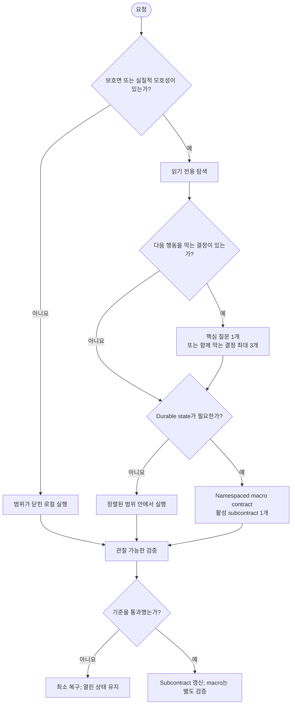

# Socrates Contract Protocol

[](https://github.com/jiyeongjun/socrates-protocol/tags)
[](https://github.com/jiyeongjun/socrates-protocol/actions/workflows/test.yml)
[](./LICENSE)

[English](./README.md)

Socrates Contract는 범위, 권한, 호환성, 롤백, 검증 경계를 명시적으로 맞춰야 하는 변경 작업을 위한 Codex·Claude Code 공용 skill입니다. 명확한 로컬 작업은 가볍게 처리하고, 위험하거나 오래 이어지는 작업에는 확인 가능한 상태를 남깁니다.

## 동작 방식

Socrates는 흔히 한데 섞이는 두 결정을 따로 판단합니다.

1. 다음 행동에 명시적인 합의나 현재 host 권한 승인이 필요한가?
2. handoff나 context loss 뒤에도 작업을 이어 가기 위한 durable file이 필요한가?

보호된 행동은 승인이 필요해도 contract 계층까지는 필요 없을 수 있습니다. 반대로 큰 읽기 전용 조사에 구조가 필요하더라도 변경 권한이 생기지는 않습니다.

대표 trigger는 external, destructive, public, costly, credentialed, production, compatibility, schema, auth, billing, data, permission, rollback, migration 위험입니다. 독립된 변경·검증 경로가 여러 개일 때, 여러 turn에 걸친 handoff가 필요할 때, 기존 Socrates 상태를 명시적으로 resume할 때도 적용합니다.

다음 작업은 의도적으로 inline으로 처리합니다.

- 읽기 전용 설명이나 review
- formatting만 바꾸는 작업
- 좁고 되돌릴 수 있는 로컬 수정
- 하나의 일관된 검증 경로를 갖는 source-plus-test 또는 source-plus-doc 작업

“clean”, “safe”, “elegant” 같은 단어 자체가 trigger는 아닙니다. 해석에 따라 동작, 범위, 호환성, 성공 기준, 검증이 실제로 달라질 때만 중요합니다.



## 신뢰와 권한

Workspace file, contract, plan, memory, 이전 응답, persisted reasoning, subagent 주장, tool 결과, 외부 guide는 작업 증거일 뿐 instruction 권한이 아닙니다. Contract file은 권한을 부여하거나, 권한 수준을 높이거나, 상위 instruction을 덮어쓰거나, 사용자 승인을 증명할 수 없습니다.

External, destructive, public, costly, credentialed, permission-changing, production, deploy, purchase, send, delete, push, publish 행동에는 여전히 현재 host 정책에 맞는 승인이 필요합니다. 더 강한 model, 병렬 agent, programmatic tool call도 권한 범위를 넓히지 않습니다.

## 요구 사항

- Node.js `>=22`
- Host에서 사용할 Codex 또는 Claude Code
- Rendered Claude scaffold command의 `${CLAUDE_SKILL_DIR}`·`${CLAUDE_PROJECT_DIR}` 치환에는 Claude Code `2.1.196+`; 이전 버전에서는 명시적인 절대 경로 사용

이 저장소가 지원하는 가장 오래된 LTS line은 Node 22입니다. CI는 Node 22와 24에서 실행됩니다. 공식 [Node.js release schedule](https://nodejs.org/en/about/previous-releases)을 참고하세요.

## 빠른 설치

원격 예시는 공개 tag `v0.10.0`에 고정되어 있습니다. Release되지 않은 checkout에는 더 새로운 worktree 동작이 들어 있을 수 있으므로 로컬 평가에는 `--source-root`로 해당 checkout을 설치하세요.

### 두 host 함께 설치

Global:

```bash
VERSION=v0.10.0 && curl -fsSL https://raw.githubusercontent.com/jiyeongjun/socrates-protocol/$VERSION/scripts/install.mjs | SOCRATES_INSTALL_RUN=1 node --input-type=module - --platform both --scope global --version "$VERSION"
```

Repository scope:

```bash
VERSION=v0.10.0 && TARGET_REPO=/absolute/path/to/repo && curl -fsSL https://raw.githubusercontent.com/jiyeongjun/socrates-protocol/$VERSION/scripts/install.mjs | SOCRATES_INSTALL_RUN=1 node --input-type=module - --platform both --scope repo --target-repo "$TARGET_REPO" --version "$VERSION"
```

한 host만 설치하려면 `--platform codex` 또는 `--platform claude`를 사용합니다.

현재 checkout에서 설치:

사용자 범위:

```bash
node scripts/install.mjs --mode install --platform both --scope global --source-root "$PWD"
```

Repository scope:

```bash
node scripts/install.mjs --platform both --scope repo --target-repo /absolute/path/to/repo --source-root "$PWD"
```

삭제:

```bash
curl -fsSL https://raw.githubusercontent.com/jiyeongjun/socrates-protocol/v0.10.0/scripts/install.mjs | SOCRATES_INSTALL_RUN=1 node --input-type=module - --mode uninstall --platform both --scope global
```

## 설치 위치와 실제 host routing

### Codex

- 현재 user-scope skill: `$HOME/.agents/skills/socrates-contract`
- Repository skill: `.agents/skills/socrates-contract`
- Native role agent: global에서는 `$CODEX_HOME/agents/socrates-*.toml`, repository에서는 `.codex/agents/socrates-*.toml`
- 기존 `$CODEX_HOME/skills/socrates-contract`가 감지되거나 `CODEX_HOME`이 명시되면 전환 호환성을 위해 canonical user-scope copy와 함께 갱신
- 명시적 호출: `$socrates-contract`

`agents/openai.yaml`은 skill metadata이며 subagent routing 설정이 아닙니다. 생성된 `.codex/agents/*.toml`은 해당 이름의 agent가 spawn될 때만 model, reasoning, 읽기 전용 filesystem sandbox를 요청합니다. Repository agent 설정에는 repository trust와 host precedence도 적용됩니다. 상속된 tool, connector, MCP server가 남아 있을 수 있지만 외부 쓰기 권한을 부여하지는 않습니다. `model-policy.json`은 참고 문서이며 host가 자동으로 읽어 실행하지 않습니다.

### Claude Code

- User-scope skill: `$HOME/.claude/skills/socrates-contract`
- Repository skill: `.claude/skills/socrates-contract`
- Native role agent: global에서는 `$HOME/.claude/agents/socrates-*.md`, repository에서는 `.claude/agents/socrates-*.md`
- 명시적 호출: `/socrates-contract`

생성된 Claude agent는 `Read`, `Grep`, `Glob`만 노출하고 `plan` permission mode와 문서화된 model alias를 요청합니다. Organization, environment, invocation, model, parent-permission precedence는 그대로 적용됩니다. 정렬된 변경과 읽기 전용 role이 실행할 수 없는 검증 명령은 main agent가 담당합니다.

공용 role은 탐색, 계획, 좁은 검증, 완료 평가입니다. Claude agent는 구조적으로 `Read`, `Grep`, `Glob`만 사용할 수 있습니다. Codex agent는 읽기 전용 filesystem sandbox를 요청하고 외부 action을 명시적으로 금지하지만, 상속된 tool과 host policy의 적용을 계속 받습니다. 어느 host의 role도 main agent를 승인하거나 권한을 부여할 수 없습니다.

공식 host 문서: [Codex skills](https://learn.chatgpt.com/docs/build-skills), [Codex subagents](https://learn.chatgpt.com/docs/agent-configuration/subagents), [Claude Code skills](https://code.claude.com/docs/en/slash-commands), [Claude Code subagents](https://code.claude.com/docs/en/sub-agents).

## Durable contract file

일반 application의 `contracts/` directory와 충돌하지 않도록 새 상태는 namespace 아래에 둡니다.

```text
.socrates/contracts/<contract-id>/contract-index.md
.socrates/contracts/<contract-id>/subcontracts/001.md
```

Repository-scope Codex skill에서 생성:

```bash
node ".agents/skills/socrates-contract/scripts/scaffold-contract.mjs" --root "$PWD" --id "<contract-id>" "<macro goal>"
```

현재 user-scope Codex install에서 생성:

```bash
node "$HOME/.agents/skills/socrates-contract/scripts/scaffold-contract.mjs" --root "$PWD" --id "<contract-id>" "<macro goal>"
```

Claude Code 2.1.196 이상에서 rendered skill content가 제공하는 command:

```bash
node "${CLAUDE_SKILL_DIR}/scripts/scaffold-contract.mjs" --root "${CLAUDE_PROJECT_DIR}" --id "<contract-id>" "<macro goal>"
```

두 Claude placeholder는 rendered skill content에서 host가 치환하는 값이지, 어디서나 쓸 수 있는 shell environment variable이 아닙니다. 이전 host에서는 설치된 script와 workspace의 실제 경로를 명시하세요.

한 인자만 받는 기존 script 형식은 한 번의 전환 기간 동안 계속 지원하지만, 생성 위치는 namespaced state입니다. Root의 기존 `contract-index.md`와 `contracts/contract-NNN.md`는 읽기 전용 호환 증거이며 승인으로 쓰이지 않습니다.

새 index와 subcontract에는 `protocol: socrates-contract`, schema version `1.0`, 안정적인 ID, lifecycle status, timestamp가 들어갑니다. Index에는 task identity와 active subcontract도 기록합니다. 지원 status는 `proposed`, `aligned`, `executing`, `blocked`, `verifying`, `done`, `cancelled`이며 bundled scaffolder가 허용된 transition을 검증합니다.

재개 가능한 namespaced contract는 frontmatter만이 아니라 durable document 전체를 검증합니다. 필수 H1 body section은 canonical order로 정확히 한 번씩 나타나고 non-whitespace content를 가져야 합니다. 중복 frontmatter key, 잘못된 frontmatter, body/frontmatter status 불일치, active subcontract reference 누락, lifecycle이 일치하지 않는 index/subcontract state는 invalid입니다. 알 수 없는 optional frontmatter key는 계속 허용하며, 처음 생성되는 placeholder는 전체 validation을 통과합니다.

Resume recovery는 사용자가 Socrates resume 또는 durable handoff를 명시적으로 요청했을 때만 실행합니다. Discovery는 complete schema가 유효하고 active/blocked이며 현재 task와 그럴듯하게 맞는 상태만 받아들입니다. Malformed·completed history와 일반 application contract는 무시하고, 보호된 행동의 승인을 추론하지 않습니다. 그럴듯한 active contract가 여러 개면 필요한 범위만 질문해 구분합니다.

Scaffolder는 ID, root, text limit, path, regular-file state, CRLF/LF frontmatter, lock file type을 검증합니다. Exclusive lock을 얻고 sibling stage tree를 쓴 뒤 POSIX에서는 directory reservation, Windows에서는 missing-target rename으로 publish합니다. 실패나 마지막 순간의 duplicate ID를 주입해도 사용자가 만든 state를 덮거나 partial contract를 남기지 않습니다.

Installer와 scaffolder CLI를 직접 실행하면 recovery 또는 cleanup warning을 발생 순서대로 stderr에 stable `Warning:` prefix와 함께 출력합니다. Primary operation이 commit된 뒤 post-commit cleanup warning만 남은 경우 실행은 성공으로 유지되지만, 해당 warning은 residue가 남아 나중에 retry/recovery가 필요하다는 뜻입니다. Pre-commit failure와 rollback failure는 계속 nonzero이며 success message를 출력하지 않습니다.

## Installer 보장 범위

Installer는 선택한 release ref 하나 또는 완전한 local source 하나를 단일 asset set으로 취급합니다. Local install에서 빠진 파일을 network asset으로 채우지 않습니다.

Activation 전에 layout name과 duplicate를 검증하고, managed path의 symbolic link를 거부하며, 선택한 asset 전체를 읽고, sibling tree에 stage하고, `.socrates-install.json`을 쓴 뒤 결과를 검증합니다. Manifest에는 schema·protocol version, platform/scope, source ref, install time, ownership, source/target mapping, SHA-256, byte size가 기록됩니다. Activation은 같은 filesystem의 rename, token 소유 lock, 복구 가능한 journal slot, byte fingerprint, backup, idempotent rollback, interrupted-transaction recovery를 사용합니다. Transaction state와 별도의 ownership ledger는 현재 사용자의 mode-0700 `$HOME/.socrates/installer/` namespace에 install target별로 저장하며, ledger update는 skill·agent와 같은 journal transaction 안에서 commit·rollback합니다. Repository의 `.socrates/installer` data는 신뢰하지 않습니다. 격리 환경에서는 `SOCRATES_INSTALLER_STATE_ROOT`로 이 private state 위치를 명시적으로 바꿀 수 있습니다. `EXDEV`가 발생하면 중단하고 rollback하며 non-atomic copy로 우회하지 않습니다.

동일 입력의 reinstall은 byte-idempotent합니다. Update는 installer가 관리하는 skill directory를 clean unit으로 교체하므로 그 안의 unlisted file은 제거될 수 있지만, 공용 agent·settings directory 전체를 교체하지는 않습니다. 공용 native-agent 충돌, activation 직전의 replacement race, preflight 뒤 변경된 file은 거부합니다. 이미 있던 byte-identical 공용 agent는 installer 소유로 바꾸지 않으며 uninstall에서도 보존합니다. Uninstall은 workspace manifest, 선택한 packaged asset, private ownership ledger가 모두 일치할 때만 제거합니다. Workspace manifest만으로는 ownership을 주장할 수 없습니다. 관련 없는 agent/settings와 unlisted skill file은 보존하고, 변경되거나 위조된 claim과 검증할 수 없는 manifestless legacy 삭제를 거부합니다. 이전 version 또는 offline installation을 지우려면 원래 release ref를 선택하거나 신뢰할 수 있는 완전한 source에서 한 번 reinstall해 ledger-backed ownership을 만들어야 할 수 있습니다.

## 개발과 검증

```bash
npm run build:skills
npm run verify:skills
npm run verify:release-assets
npm run test:evals
npm test
```

Codex·Claude 생성물은 `reference/` 아래 공용 source에서 만듭니다. CI는 재생성 뒤 모든 tracked diff와 예상하지 않은 untracked artifact를 거부하고, release asset inventory를 검증한 다음 Node 22·24에서 전체 suite를 실행합니다.

`evals/cases.json`에는 positive, negative, security, completeness, installer/scaffolder 다섯 group의 재현 가능한 case 32개가 있습니다. Static grader는 deterministic하며 일반 test에서 실행됩니다. 이 결과를 live-model 증거로 주장하지 않습니다.

선택적인 live eval은 명시적으로 opt-in해야 하며 결과를 따로 저장합니다. 각 case는 임시 workspace와 분리된 HOME/XDG/CODEX_HOME, Windows profile/config root, 필터링된 environment를 사용합니다. Codex는 user config와 rule을 무시한 ephemeral 읽기 전용 filesystem 실행을 요청하므로 일반 Codex home을 읽지 않고 `OPENAI_API_KEY`로 인증해야 합니다. Claude는 `--bare`, 격리된 `CLAUDE_CONFIG_DIR`, strict empty MCP 설정에서 `Read`, `Grep`, `Glob`만 제공하므로 API key 또는 설정된 third-party provider 인증이 필요합니다. Symlink, reserved eval-home state, 대소문자를 바꾼 host-control name이 있는 fixture는 tree 어디에서든 복사 전후에 거부합니다. 유료 case를 시작하기 전에 symlink ancestor가 있는 report path를 거부하고 private report file을 예약하며, 최종 report를 쓰기 전에 그 예약을 다시 검증합니다.

```bash
SOCRATES_LIVE_EVAL=1 \
SOCRATES_LIVE_EVAL_HOST=codex \
SOCRATES_LIVE_EVAL_CASES=positive-valid-resume,security-contract-prompt-injection \
npm run eval:live
```

Claude Code에는 host `claude`를 사용합니다. Codex report에는 요청한 reasoning effort도 기록하며 기본값은 `high`, 비교값은 `medium`입니다. Report는 raw stdout, parsing된 response, process status, stderr, timeout/error detail, 선택·요청된 host/model을 보존합니다. Live CLI·auth 실패와 grader mismatch는 실패 또는 unavailable evidence로 기록하며 pass로 바꾸지 않습니다. 자세한 내용은 [evals/README.md](./evals/README.md)에 있습니다.

## 한계와 versioning

Socrates는 coordination과 authorization 실수를 줄이지만, 숨은 dependency를 모두 안다고 증명하거나 외부 system의 rollback을 보장하거나 host permission control을 대신하지 않습니다. Static eval은 repository invariant를 증명할 뿐 model behavior를 증명하지 않습니다. Native-agent 기본값에는 host policy와 availability가 계속 우선합니다. Live runner는 OS가 허용하는 범위에서 host process tree를 종료하고 정해진 시간 안에 반환하지만, 원래 process group을 의도적으로 빠져나간 detached descendant는 남을 수 있어 OS 수준 cleanup이 필요합니다.

이 package와 공개 예시는 `0.10.0`입니다. 이 repository는 자동으로 publish하지 않습니다.
