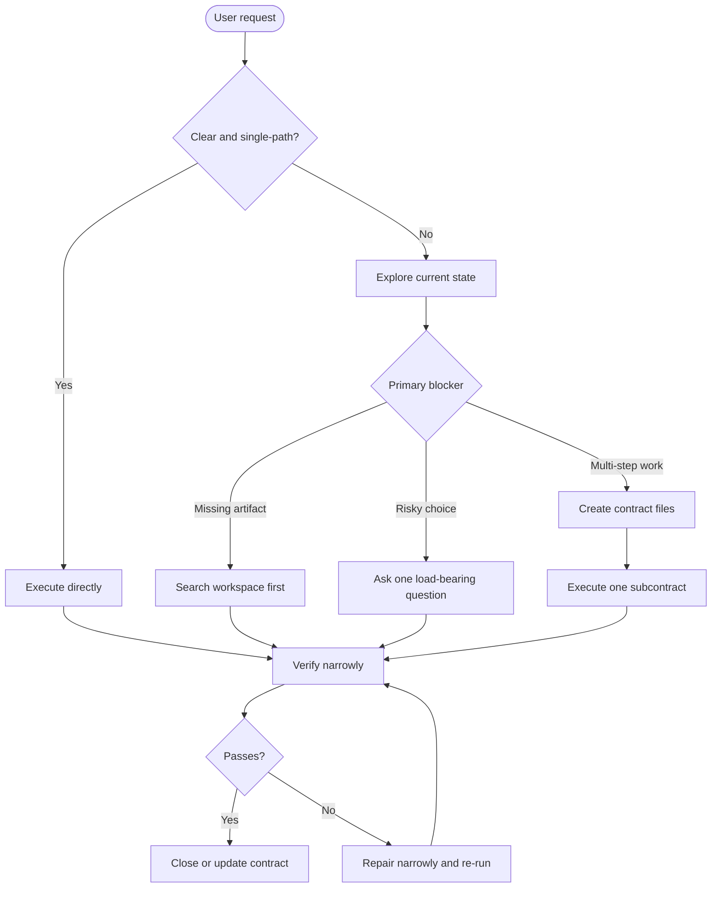

# Socrates Contract Protocol

[](https://github.com/jiyeongjun/socrates-protocol/tags)
[](https://github.com/jiyeongjun/socrates-protocol/actions/workflows/test.yml)
[](./LICENSE)

[English](./README.md)

파일, 데이터, 설정, 외부 시스템, 사용자에게 보이는 상태를 바꾸기 전에 사용자와 에이전트가 명시적인 contract를 맞춰야 하는 경우를 위한 mutation skill입니다.

## 하는 일

Socrates Contract는 요청이 이미 명확하고 위험이 낮으며 한 단계로 끝날 때는 개입하지 않습니다. 목표, 범위, 성공 기준, 보호면, 분해 방식이 실제 변경 결과를 바꿀 수 있을 때만 개입합니다.

핵심 동작:

- 명확하고 낮은 위험의 요청: 바로 실행하고 검증
- 누락된 파일이나 대상: 먼저 workspace에서 찾고, 그래도 없을 때 질문
- 위험한 미해결 작업: 가장 중요한 안전 결정 하나를 먼저 질문
- 여러 mutation 경로가 가능함: 실행 전에 macro contract 정렬
- 큰 목표: `contract-index.md`와 subcontract별 파일 생성
- 완료: 모든 subcontract와 macro contract를 검증한 뒤 닫기

대표 trigger:

- `elegant`, `clean`, `good`, `robust` 같은 모호한 선호 표현
- API, schema, migration, auth, billing, deletion, production 변경
- 실질적으로 다른 mutation 경로가 여러 개 남아 있는 요청
- env var, config key, public API, persisted field rename
- 여러 clarification round, 보이는 상태 추적, 독립 검증 가능한 하위 목표가 필요한 작업

## 흐름

Socrates Contract는 하나의 router skill입니다. 가능한 가장 가벼운 안전 경로부터 시도하고, durable alignment가 필요할 때만 macro contract와 subcontract 파일로 올라갑니다.



요약:

- 명확한 요청: 바로 작업
- 누락된 대상: 먼저 탐색하고 검색, 질문은 나중에
- 위험한 변경: 멈추고 안전 결정을 명확히 함
- 큰 목표: `contract-index.md`와 subcontract별 파일 사용
- 각 subcontract 뒤: 좁게 검증하고, 필요하면 고친 뒤 contract 파일 갱신

## 한계

Socrates Contract는 ambiguity가 load-bearing인지 판단할 때 여전히 모델 판단에 의존합니다. 모든 숨은 제약을 반드시 찾아내는 보장이 아니라 위험을 줄이는 도구입니다.

효과적인 경우:

- prompt나 code context에 high-risk signal이 명시되어 있음
- 미해결 분기나 누락 제약이 텍스트로 근거를 가짐
- 사용자가 소수의 구체적인 clarification question에 답할 수 있음
- 같은 작업의 durable contract state가 여러 턴에 걸쳐 실제로 필요함

## 빠른 설치

아래 예시는 release tag `v0.8.0` 기준입니다. 이 tag가 아직 push되기 전 worktree를 보고 있다면 checkout된 repo의 `scripts/install.mjs`를 직접 실행하세요. 현재 worktree의 package version은 `0.8.0`입니다.

설치기는 Node `24+`가 필요합니다.

### Codex

권장 global install:

```bash
VERSION=v0.8.0 && curl -fsSL https://raw.githubusercontent.com/jiyeongjun/socrates-protocol/$VERSION/scripts/install.mjs | SOCRATES_INSTALL_RUN=1 node --input-type=module - --platform codex --scope global --version "$VERSION"
```

repo에 설치:

```bash
VERSION=v0.8.0 && TARGET_REPO=/absolute/path/to/your/repo && curl -fsSL https://raw.githubusercontent.com/jiyeongjun/socrates-protocol/$VERSION/scripts/install.mjs | SOCRATES_INSTALL_RUN=1 node --input-type=module - --platform codex --scope repo --target-repo "$TARGET_REPO" --version "$VERSION"
```

삭제:

```bash
curl -fsSL https://raw.githubusercontent.com/jiyeongjun/socrates-protocol/v0.8.0/scripts/install.mjs | SOCRATES_INSTALL_RUN=1 node --input-type=module - --mode uninstall --platform codex --scope global
```

Codex 설치 메모:

- global install은 skill을 `~/.codex/skills/socrates-contract`에 씁니다
- repo install은 skill을 `.agents/skills/socrates-contract`에 씁니다
- 생성된 `agents/openai.yaml`은 host가 지원하는 경우 implicit invocation을 켭니다
- 명시적 `$socrates-contract` 호출이 skill을 강제로 쓰는 가장 결정적인 방법입니다
- install을 다시 실행하면 이 installer가 관리하는 Socrates Contract 파일을 덮어씁니다

### Claude Code

권장 global install:

```bash
VERSION=v0.8.0 && curl -fsSL https://raw.githubusercontent.com/jiyeongjun/socrates-protocol/$VERSION/scripts/install.mjs | SOCRATES_INSTALL_RUN=1 node --input-type=module - --platform claude --scope global --version "$VERSION"
```

repo에 설치:

```bash
VERSION=v0.8.0 && TARGET_REPO=/absolute/path/to/your/repo && curl -fsSL https://raw.githubusercontent.com/jiyeongjun/socrates-protocol/$VERSION/scripts/install.mjs | SOCRATES_INSTALL_RUN=1 node --input-type=module - --platform claude --scope repo --target-repo "$TARGET_REPO" --version "$VERSION"
```

삭제:

```bash
curl -fsSL https://raw.githubusercontent.com/jiyeongjun/socrates-protocol/v0.8.0/scripts/install.mjs | SOCRATES_INSTALL_RUN=1 node --input-type=module - --mode uninstall --platform claude --scope global
```

Claude 설치 메모:

- global install은 skill을 `~/.claude/skills/socrates-contract`에 씁니다
- repo install은 skill을 `.claude/skills/socrates-contract`에 씁니다
- Claude 전용 Socrates subagent는 `.claude/agents/` 또는 `~/.claude/agents/`에 설치됩니다
- 세부 on-demand guidance는 `references/` 아래 한 단계 깊이에 있습니다
- role-based model guidance는 `model-policy.json`에 있습니다
- install을 다시 실행하면 이 installer가 관리하는 Socrates Contract 파일을 덮어씁니다

## 버전 정책

Socrates Contract Protocol은 SemVer 스타일 tag를 사용합니다. 현재 release tag는 `v0.8.0`이고, 현재 worktree의 package version은 `0.8.0`입니다.

- 빠른 설치 예시는 재현 가능한 설치를 위해 현재 release tag에 고정합니다
- `npm run verify:release-assets`는 기본적으로 현재 worktree를 검사합니다
- `npm run verify:release-assets -- --ref v0.8.0`로 installer asset이 해당 release ref에 모두 들어 있는지 확인할 수 있습니다
- `0.x` release는 minor version 사이에서도 contract가 바뀔 수 있는 불안정 contract로 봅니다
- `v0.8.0`은 contract-file state만 유지합니다

## Contract 파일 동작 방식

오래 이어질 multi-step 작업, protected-surface 작업, 또는 handoff가 중요한 작업은 보이는 contract 파일을 사용합니다. 하나의 일관된 검증 경로가 있는 좁고 되돌리기 쉬운 수정은 구현 파일과 테스트 또는 문서를 함께 건드려도 inline으로 처리할 수 있습니다.

Socrates Contract는 목표에 오래 남길 handoff, protected-surface 계획, context loss 뒤에도 유지되어야 하는 미해결 결정, 또는 여러 독립 문제가 필요할 때 `contract-index.md`와 `contracts/contract-NNN.md`를 제안합니다.

- macro index는 기본적으로 workspace root에 둡니다.
- 관련 없는 `contract-index.md` 또는 `contracts/` directory가 이미 있으면 덮어쓰지 않습니다. 사용자가 위치를 이미 지정하지 않았다면 위치 또는 교체 여부에 관한 질문 하나를 해야 합니다.
- index는 macro goal, 진행 상태, 결정, 열린 질문, 각 subcontract 경로를 기록합니다.
- subcontract 파일은 `contracts/` 아래에 두며 active task, inputs, completion criteria, mutation plan, verification, work log, result를 담습니다.
- 한 번에 하나의 subcontract만 active여야 합니다.
- mutation 전에 active subcontract는 aligned 상태이거나 하나의 명시적 사용자 질문에 blocked 상태여야 합니다.
- mutation 뒤에는 가장 좁은 관련 검증부터 실행하고, 필요하면 복구한 뒤에만 subcontract를 `done`으로 표시합니다.
- subcontract가 `done`, `blocked`, 또는 중요한 scope 변경 상태가 될 때마다 `contract-index.md`를 갱신합니다.
- 모든 subcontract가 `done`이고 macro success criteria가 검증된 뒤에만 macro contract를 닫습니다.
- contract 파일은 숨은 task manager가 아니라 보이는 user-agent state입니다.

## 대표 상호작용

```text
$socrates-contract "write a JavaScript function sum(numbers) that returns 0 for an empty array"
# 바로 실행합니다. contract 파일을 만들지 않습니다.
```

```text
$socrates-contract "Design the account deletion API for our production SaaS. It must be GDPR-compliant and safe."
# macro goal, protected surfaces, success criteria, 첫 load-bearing question을 정리합니다.
# 정렬이 끝나면 contract-index.md와 첫 bounded problem용 contracts/contract-001.md를 만듭니다.
```

```text
$socrates-contract "show the current contract"
# contract-index.md와 active subcontract를 읽고 진행 상태와 blocker를 보여줍니다.
```

```text
$socrates-contract "close the contract"
# 모든 subcontract와 macro success criteria를 검증한 뒤 닫습니다.
# 작업이 미완료로 멈췄다면 handoff를 위해 보이는 contract 파일을 남깁니다.
```
