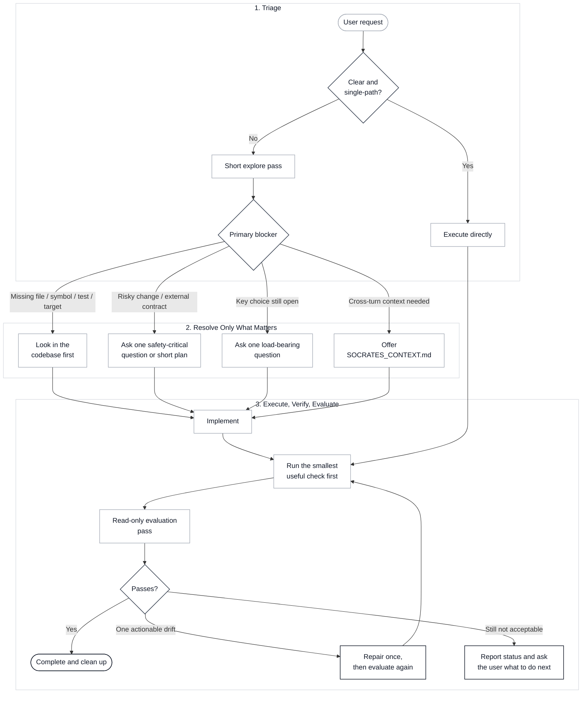

# Socrates Protocol

[](https://github.com/jiyeongjun/socrates-protocol/tags)
[](https://github.com/jiyeongjun/socrates-protocol/actions/workflows/test.yml)
[](./LICENSE)

[한국어](./README.ko.md)

A coding skill for cases where ambiguity, risk, or implementation branch choice would materially change the result.

## What It Does

Socrates stays out of the way when the request is already explicit and single-path.
It steps in only when clarification would change the implementation.
When the same ambiguous task needs continued context across turns, it can keep one shared file at the workspace root: `SOCRATES_CONTEXT.md`.

Core behavior:

- clear request: execute directly
- missing artifact or target: look for it in the codebase first; otherwise ask for it
- high-risk unresolved work: ask the most safety-critical question first
- multiple valid implementation branches: surface the main tradeoff before coding
- continued multi-turn context: ask before creating `SOCRATES_CONTEXT.md`
- successful completion: automatically delete `SOCRATES_CONTEXT.md`

Typical triggers:

- vague preference words like `elegant`, `clean`, `good`, `robust`
- API, schema, migration, auth, billing, deletion, or production changes
- requests that still allow multiple materially different implementations
- renames of env vars, config keys, public APIs, or persisted fields
- tasks likely to require several clarification rounds across turns

## How It Flows

Socrates is one router skill.
It tries the lightest safe path first instead of asking questions by default.



In short:

- clear request: do the work
- missing target: explore and search first, ask later
- risky change: stop and clarify the safety decision
- shared context: use one file, `SOCRATES_CONTEXT.md`
- after changes: verify narrowly, then run one evaluation pass and at most one repair loop

## Limitations

Socrates still relies on LLM judgment to decide whether ambiguity is load-bearing.
That means the entry check has the same basic limitation as the model it is guiding.

It is most effective when:

- high-risk signals are explicit in the prompt or visible in the code context
- the unresolved fork or missing constraint is already textually grounded
- the user can answer a small number of concrete clarification questions
- continued context across turns is genuinely necessary for the same task

It may miss:

- subtle implicit assumptions that are never stated
- team norms or business constraints that are not visible in the prompt or repo
- ambiguity that only becomes obvious deeper into implementation

Use it as a risk-reduction aid, not as a guarantee that every load-bearing ambiguity has been surfaced.
`SOCRATES_CONTEXT.md` is a shared current-context file, not a task manager.

## Quick Install

These examples target release tag `v0.4.2`.
If you are reading this worktree before that tag is pushed, run the checked-out repo's `scripts/install.mjs` directly.
The current package version in this worktree is `0.4.2`.

### Codex

Recommended quick install:

```bash
VERSION=v0.4.2 && curl -fsSL https://raw.githubusercontent.com/jiyeongjun/socrates-protocol/$VERSION/scripts/install.mjs | SOCRATES_INSTALL_RUN=1 node --input-type=module - --platform codex --scope global --version "$VERSION" --enable-codex-hooks
```

Want the Stop hook from the start:

```bash
VERSION=v0.4.2 && curl -fsSL https://raw.githubusercontent.com/jiyeongjun/socrates-protocol/$VERSION/scripts/install.mjs | SOCRATES_INSTALL_RUN=1 node --input-type=module - --mode install --platform codex --scope global --version "$VERSION" --feature stop-hook --enable-codex-hooks
```

Codex hook activation:

- the recommended install command above already enables `codex_hooks = true` in `~/.codex/config.toml`
- if you installed earlier without `--enable-codex-hooks`, the skill still works, but the `SessionStart` sources (`startup`, `resume`, `clear`, `compact`) and optional `Stop` hook do not run until you enable that feature flag
- you can fix an existing install by rerunning the installer with `--enable-codex-hooks`, or by running this one-time fallback command:

```bash
mkdir -p ~/.codex && node --input-type=module - <<'EOF'
import { existsSync, mkdirSync, readFileSync, writeFileSync } from "node:fs";
import { homedir } from "node:os";
import path from "node:path";

const configPath = path.join(homedir(), ".codex", "config.toml");
mkdirSync(path.dirname(configPath), { recursive: true });
const existing = existsSync(configPath) ? readFileSync(configPath, "utf8") : "";
const featuresPattern = /^\[features\]\s*$(?:\n(?!\[).*)*/m;

let next = existing;
if (!featuresPattern.test(existing)) {
  next = `${existing.trimEnd()}\n\n[features]\ncodex_hooks = true\n`.trimStart();
} else {
  next = existing.replace(featuresPattern, (section) => {
    if (/^\s*codex_hooks\s*=.*$/m.test(section)) {
      return section.replace(/^\s*codex_hooks\s*=.*$/m, "codex_hooks = true");
    }
    return `${section}\ncodex_hooks = true`;
  });
}

writeFileSync(configPath, next.endsWith("\n") ? next : `${next}\n`, "utf8");
console.log(`Updated ${configPath}`);
EOF
```

Update in place:

- rerun the same install command with the version you want
- the installer overwrites stale Socrates files, keeps unrelated hook entries, and installs the hook support files needed for self-contained execution

Uninstall:

```bash
curl -fsSL https://raw.githubusercontent.com/jiyeongjun/socrates-protocol/v0.4.2/scripts/install.mjs | SOCRATES_INSTALL_RUN=1 node --input-type=module - --mode uninstall --platform codex --scope global
```

Install into a repository:

```bash
VERSION=v0.4.2 && TARGET_REPO=/absolute/path/to/your/repo && curl -fsSL https://raw.githubusercontent.com/jiyeongjun/socrates-protocol/$VERSION/scripts/install.mjs | SOCRATES_INSTALL_RUN=1 node --input-type=module - --platform codex --scope repo --target-repo "$TARGET_REPO" --version "$VERSION" --enable-codex-hooks
```

Explicit invocation example:

```text
$socrates Design the account deletion API for our production SaaS. It must be GDPR-compliant and safe.
```

Auto-load example:

```text
Design the account deletion API for our production SaaS. It must be GDPR-compliant and safe.
```

Codex/OpenAI note:

- the generated agent metadata enables implicit invocation when the host supports it
- explicit `$socrates` remains the most deterministic path when you want to force the skill

Optional Codex hook:

- this repo also ships a conservative repo-local hook at `.codex/hooks.json`
- it only runs on `SessionStart` and only adds context when `SOCRATES_CONTEXT.md` already exists
- it restores shared context on `startup`, `resume`, `clear`, and `compact`, so long-running work can survive compaction without inventing another state file
- it helps resumed Socrates tasks recover their shared context without changing fast-path tasks
- Codex hooks are configured by `hooks.json` layers, not by per-skill activation, so this hook file is loaded whenever the repo hook layer is active
- the included hook script is therefore intentionally a no-op unless it finds `SOCRATES_CONTEXT.md`
- the search walks upward only until the nearest git root, so a nested repo does not accidentally adopt a parent repo's `SOCRATES_CONTEXT.md`
- the quick-install command above installs the Socrates router skill, mirrored `references/` files, and the Socrates `SessionStart` hook, merging into any existing `hooks.json`
- the recommended Codex install command above also enables the required `codex_hooks = true` feature flag for you

Optional Stop hook:

- the default install does not add a `Stop` hook
- install it separately only if you want Socrates to keep pushing one more clarifying turn when a context-backed task has not reached a stable stop point yet
- this hook is stronger than `SessionStart`: it can continue a turn instead of just restoring context
- because hooks are config-scoped rather than skill-scoped, it may still affect non-Socrates work in the same repo if a stale context file is left behind
- the included implementation is strict and state-driven: it requires a canonical `SOCRATES_CONTEXT.md` and only continues while `status: "clarifying"` with `clarifying_phase: "needs_question"`
- it does not inspect the assistant message to decide whether a question was phrased “well enough”
- it stops intervening once the shared context file leaves `clarifying_phase: "needs_question"`
- if a stale clarifying file remains in the repo, the Stop hook will keep intervening until you update, replace, or delete `SOCRATES_CONTEXT.md`

Install the optional Codex Stop hook:

```bash
VERSION=v0.4.2 && curl -fsSL https://raw.githubusercontent.com/jiyeongjun/socrates-protocol/$VERSION/scripts/install.mjs | SOCRATES_INSTALL_RUN=1 node --input-type=module - --mode install --platform codex --scope global --version "$VERSION" --feature stop-hook --enable-codex-hooks
```

Remove only the optional Codex Stop hook:

```bash
curl -fsSL https://raw.githubusercontent.com/jiyeongjun/socrates-protocol/v0.4.2/scripts/install.mjs | SOCRATES_INSTALL_RUN=1 node --input-type=module - --mode uninstall --platform codex --scope global --feature stop-hook
```

### Claude Code

Recommended quick install:

```bash
VERSION=v0.4.2 && curl -fsSL https://raw.githubusercontent.com/jiyeongjun/socrates-protocol/$VERSION/scripts/install.mjs | SOCRATES_INSTALL_RUN=1 node --input-type=module - --platform claude --scope global --version "$VERSION"
```

Want the Stop hook from the start:

```bash
VERSION=v0.4.2 && curl -fsSL https://raw.githubusercontent.com/jiyeongjun/socrates-protocol/$VERSION/scripts/install.mjs | SOCRATES_INSTALL_RUN=1 node --input-type=module - --mode install --platform claude --scope global --version "$VERSION" --feature stop-hook
```

Claude hook behavior:

- the recommended install command already installs the Socrates router skill, mirrored `references/` files, Claude-only subagents in `.claude/agents/`, and the conservative `SessionStart` hook
- the default install does not add the stronger `Stop` hook
- the second command above adds that stronger `Stop` hook from the start

Update in place:

- rerun the same install command with the version you want
- the installer overwrites stale Socrates files, keeps unrelated settings, and installs the hook support files needed for self-contained execution

Uninstall:

```bash
curl -fsSL https://raw.githubusercontent.com/jiyeongjun/socrates-protocol/v0.4.2/scripts/install.mjs | SOCRATES_INSTALL_RUN=1 node --input-type=module - --mode uninstall --platform claude --scope global
```

Install into a repository:

```bash
VERSION=v0.4.2 && TARGET_REPO=/absolute/path/to/your/repo && curl -fsSL https://raw.githubusercontent.com/jiyeongjun/socrates-protocol/$VERSION/scripts/install.mjs | SOCRATES_INSTALL_RUN=1 node --input-type=module - --platform claude --scope repo --target-repo "$TARGET_REPO" --version "$VERSION"
```

Explicit invocation example:

```text
/socrates Design the account deletion API for our production SaaS. It must be GDPR-compliant and safe.
```

Auto-load example:

```text
Design the account deletion API for our production SaaS. It must be GDPR-compliant and safe.
```

Claude setup notes:

- skill path: `.claude/skills/<skill-name>/SKILL.md`
- Claude-only Socrates subagents: `.claude/agents/socrates-explore.md`, `.claude/agents/socrates-plan.md`, `.claude/agents/socrates-verify.md`, `.claude/agents/socrates-evaluate.md`
- detailed on-demand guidance lives one level deep under `.claude/skills/socrates/references/`
- role-based model routing lives in `model-policy.json`, so the main skill text does not hardcode current model names
- current repo version supports explicit `/socrates` use and auto-load when relevant
- this repo also ships a conservative project hook at `.claude/settings.json`
- it only runs on `SessionStart` and only adds context when `SOCRATES_CONTEXT.md` already exists
- it restores shared context on `startup`, `resume`, `clear`, and `compact`, so long-running work can survive compaction without inventing another state file
- Claude hooks are configured by settings layers, not by per-skill activation, so the included hook is intentionally a no-op unless it finds the shared context doc
- the search walks upward only until the nearest git root, so a nested repo does not accidentally adopt a parent repo's `SOCRATES_CONTEXT.md`
- the quick-install command above installs the Socrates router skill, mirrored `references/` files, Claude-only subagents, and the Socrates `SessionStart` hook, merging into any existing `.claude/settings.json`

Optional Claude Stop hook:

- the default install does not add a `Stop` hook
- install it separately only if you want Socrates to keep pushing one more clarifying turn when a context-backed task has not reached a stable stop point yet
- this hook is stronger than `SessionStart`: it can continue a turn instead of just restoring context
- because hooks are config-scoped rather than skill-scoped, it may still affect non-Socrates work in the same project if a stale context file is left behind
- the included implementation is strict and state-driven: it requires a canonical `SOCRATES_CONTEXT.md` and only continues while `status: "clarifying"` with `clarifying_phase: "needs_question"`
- it does not inspect the assistant message to decide whether a question was phrased “well enough”
- it stops intervening once the shared context file leaves `clarifying_phase: "needs_question"`
- if a stale clarifying file remains in the project, the Stop hook will keep intervening until you update, replace, or delete `SOCRATES_CONTEXT.md`

Install the optional Claude Stop hook:

- same command as the quick note above

Remove only the optional Claude Stop hook:

```bash
curl -fsSL https://raw.githubusercontent.com/jiyeongjun/socrates-protocol/v0.4.2/scripts/install.mjs | SOCRATES_INSTALL_RUN=1 node --input-type=module - --mode uninstall --platform claude --scope global --feature stop-hook
```

## Versioning

Socrates Protocol uses SemVer-style tags.
The current release tag is `v0.4.2`.
The current package version in this worktree is `0.4.2`.

- the quick-install examples pin to the current release tag for reproducible installs
- `npm run verify:release-assets` checks the current worktree by default
- run `npm run verify:release-assets -- --ref v0.4.2` to confirm every installer asset exists in that release ref
- treat `0.x` releases as unstable contracts that may still change between minor versions

### Context File Format

`SOCRATES_CONTEXT.md` currently uses `version: 3` in YAML frontmatter.

- while the project is still in `0.x`, the context file format is not yet a stable compatibility contract
- if the format changes incompatibly, increment the frontmatter version instead of silently reinterpreting old files
- prefer normalize-or-rewrite behavior on the next write rather than maintaining a long migration chain before `1.0`

To run the local validation scripts exactly as CI does, use Node `24+`.

## How Shared Context Works

Socrates only proposes `SOCRATES_CONTEXT.md` when continued context across turns would materially change the implementation.

- The file lives at the workspace root: prefer the git repo root; otherwise use the current working directory.
- The file is the only persisted state. There is no hidden JSON, archive log, or task registry behind it.
- The YAML frontmatter is the canonical machine-readable state.
- The Markdown body is a rendered view of that state and may be regenerated on the next update.
- `clarifying_phase` makes the clarification state explicit instead of inferring it from the last assistant message.
- When `clarifying_phase` is `needs_question`, ask the pending question and rewrite the file to `awaiting_user_answer` before ending the turn.
- When `clarifying_phase` is `awaiting_user_answer`, wait for the user instead of implementing.
- If you enable the optional Stop hook, it enforces that same state directly and does not try to recover “already asked” status from free-form assistant text.
- Socrates expects the standard generated frontmatter shape, not arbitrary YAML forms.
- Socrates rewrites the whole file on each update using YAML frontmatter plus fixed Markdown sections.
- If you decline once, Socrates explains the tradeoff briefly and asks once more.
- If you decline twice, Socrates continues without persisted context and warns that cross-turn context is not guaranteed.
- If `SOCRATES_CONTEXT.md` already exists for the same task, Socrates reads it first and keeps updating it.
- If `SOCRATES_CONTEXT.md` already exists for a different task, Socrates asks whether to replace it or keep using the current file.
- `ready` means no load-bearing unknowns remain and implementation has not started.
- `executing` means implementation started after the shared context reached `ready`.
- Keep inline verification, evaluation, and repair flow out of `SOCRATES_CONTEXT.md`; that loop stays in the current turn and is not recorded as execution micro-state in the file.
- `version: 3` is the only canonical runtime format. Legacy `version: 1` and `version: 2` files must be normalized or deleted before hooks trust them again.
- If the file is malformed or the canonical body sections drift out of sync with frontmatter, Socrates asks whether to normalize it to the canonical version 3 format.
- When the `SessionStart` hook sees a malformed persisted context, it injects repair guidance and points to the local Socrates context helper instead of silently treating the file as valid state.
- Automatic normalization is frontmatter-driven. Body-only or partially corrupted files may require manual rewrite after diagnosis.
- To inspect or normalize an existing file locally, run `node scripts/context-doc.mjs doctor --cwd /path/to/workspace` or `node scripts/context-doc.mjs repair --cwd /path/to/workspace`.
- After install, the same helper is available as `~/.codex/hooks/socrates_context_doc_helper.mjs`, `~/.claude/hooks/socrates_context_doc_helper.mjs`, or the repo-local hook path under `.codex/hooks/` or `.claude/hooks/`.
- When the task successfully ends, Socrates automatically deletes `SOCRATES_CONTEXT.md`.
- If the task stops incomplete or blocked, Socrates asks whether to keep or delete it.
- This is a shared current-context file, not a task manager.
- If you enable the optional Codex repo hook, it only restores context on session start when `SOCRATES_CONTEXT.md` already exists.

The file shape is fixed:

```md
---
version: 3
status: "clarifying"
task: "..."
knowns:
  - "..."
unknowns:
  - "..."
next_question: "..."
clarifying_phase: "needs_question"
decisions: []
updated_at: "2026-03-29T00:00:00.000Z"
---

# Socrates Context

## Task
...

## What Socrates Knows
- ...

## What Socrates Still Needs
- ...

## Next Question
...

## Fixed Decisions
- None.

## Status
clarifying
```

`status` should be one of `clarifying`, `ready`, or `executing`.
`clarifying_phase` should be `needs_question` or `awaiting_user_answer` while `status` is `clarifying`.
Only move to `executing` after the file has reached `ready` with no unresolved `unknowns`.
Keep verify -> evaluate -> repair -> re-verify -> re-evaluate inline inside the current turn rather than storing those substeps in the file.

## Representative Interactions

```bash
/socrates "write a JavaScript function sum(numbers) that returns 0 for an empty array"
# Execute directly.
# Do not create SOCRATES_CONTEXT.md.
```

```bash
/socrates "Design the account deletion API for our production SaaS. It must be GDPR-compliant and safe."
# Socrates: This task looks like it needs shared context. Should I keep it in SOCRATES_CONTEXT.md at the workspace root?
# User: yes
# Socrates creates SOCRATES_CONTEXT.md and continues with the next load-bearing question.
```

```bash
/socrates "show the current context"
# Socrates reads SOCRATES_CONTEXT.md and shows the current task, knowns, unknowns, next question, decisions, and status.
```

```bash
/socrates "we're done"
# If the task succeeded, Socrates automatically deletes SOCRATES_CONTEXT.md.
# If the task stopped incomplete, Socrates asks whether to keep or delete it.
```
