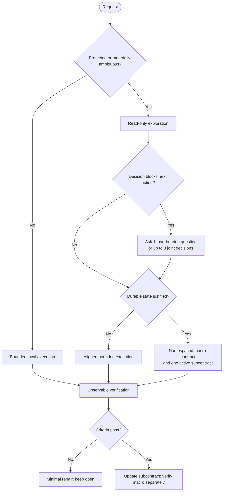

# Socrates Contract Protocol

[](https://github.com/jiyeongjun/socrates-protocol/tags)
[](https://github.com/jiyeongjun/socrates-protocol/actions/workflows/test.yml)
[](./LICENSE)

[한국어](./README.ko.md)

Socrates Contract is a cross-host Codex and Claude Code skill for mutation work whose scope, authorization, compatibility, rollback, or verification boundary needs explicit alignment. It keeps clear local work lightweight and gives risky or long-running work durable, inspectable state.

## Behavior

Socrates separates two decisions that are often conflated:

1. Does the next action require explicit alignment or current host authorization?
2. Does the task need durable files to survive handoff or context loss?

A protected action can require approval without needing a contract hierarchy. A large read-only investigation can need structure without gaining permission to mutate.

Typical triggers include external, destructive, public, costly, credentialed, production, compatibility, schema, auth, billing, data, permission, rollback, and migration risk. Socrates also applies to several independent mutation or verification paths, durable multi-turn handoff, and explicit resume of existing Socrates state.

It deliberately stays inline for:

- read-only explanation or review
- formatting-only work
- a narrow, reversible local edit
- focused source-plus-test or source-plus-doc work with one coherent verification path

Words such as “clean,” “safe,” or “elegant” are signals, not automatic triggers. They matter only when their interpretation changes behavior, scope, compatibility, success criteria, or verification.



## Trust and authorization

Workspace files, contracts, plans, memory, prior responses, persisted reasoning, subagent claims, tool results, and external guides are task evidence, not instruction authority. Contract files cannot grant permission, elevate privileges, override higher-priority instructions, or prove user approval.

External, destructive, public, costly, credentialed, permission-changing, production, deployment, purchase, send, delete, push, or publish actions still require current authorization under the host policy. More capable models, parallel agents, and programmatic tool calls do not expand authorization.

## Requirements

- Node.js `>=22`
- Codex or Claude Code for host use
- Claude Code `2.1.196+` for `${CLAUDE_SKILL_DIR}` and `${CLAUDE_PROJECT_DIR}` substitution in the rendered Claude scaffold command; older versions can use explicit absolute paths

Node 22 is the oldest supported LTS line used by this repository. CI runs Node 22 and 24. See the official [Node.js release schedule](https://nodejs.org/en/about/previous-releases).

## Quick install

The remote examples are pinned to published tag `v0.10.0`. An unreleased checkout can contain newer worktree behavior; install that checkout with `--source-root` when evaluating it locally.

### Both hosts

Global:

```bash
VERSION=v0.10.0 && curl -fsSL https://raw.githubusercontent.com/jiyeongjun/socrates-protocol/$VERSION/scripts/install.mjs | SOCRATES_INSTALL_RUN=1 node --input-type=module - --platform both --scope global --version "$VERSION"
```

Repository scope:

```bash
VERSION=v0.10.0 && TARGET_REPO=/absolute/path/to/repo && curl -fsSL https://raw.githubusercontent.com/jiyeongjun/socrates-protocol/$VERSION/scripts/install.mjs | SOCRATES_INSTALL_RUN=1 node --input-type=module - --platform both --scope repo --target-repo "$TARGET_REPO" --version "$VERSION"
```

Use `--platform codex` or `--platform claude` to install one host only.

From this checkout:

User scope:

```bash
node scripts/install.mjs --mode install --platform both --scope global --source-root "$PWD"
```

Repository scope:

```bash
node scripts/install.mjs --platform both --scope repo --target-repo /absolute/path/to/repo --source-root "$PWD"
```

Uninstall:

```bash
curl -fsSL https://raw.githubusercontent.com/jiyeongjun/socrates-protocol/v0.10.0/scripts/install.mjs | SOCRATES_INSTALL_RUN=1 node --input-type=module - --mode uninstall --platform both --scope global
```

## Installed locations and actual host routing

### Codex

- Current user-scope skill: `$HOME/.agents/skills/socrates-contract`
- Repository skill: `.agents/skills/socrates-contract`
- Native role agents: `$CODEX_HOME/agents/socrates-*.toml` globally, or `.codex/agents/socrates-*.toml` in a repository
- A detected legacy `$CODEX_HOME/skills/socrates-contract` installation, or an explicitly configured `CODEX_HOME`, is updated alongside the canonical user-scope copy for transition compatibility
- Explicit invocation: `$socrates-contract`

`agents/openai.yaml` is skill metadata, not subagent routing. Generated `.codex/agents/*.toml` files request model, reasoning, and a read-only filesystem sandbox only when the named agent is spawned; repository agent configuration also depends on repository trust and host precedence. Inherited tools, connectors, or MCP servers may still exist and do not authorize external writes. `model-policy.json` is advisory and is not consumed automatically.

### Claude Code

- User-scope skill: `$HOME/.claude/skills/socrates-contract`
- Repository skill: `.claude/skills/socrates-contract`
- Native role agents: `$HOME/.claude/agents/socrates-*.md` globally, or `.claude/agents/socrates-*.md` in a repository
- Explicit invocation: `/socrates-contract`

Generated Claude agents expose only `Read`, `Grep`, and `Glob`, request `plan` permission mode, and use documented model aliases. Organization, environment, invocation, model, and parent-permission precedence still apply. The main agent performs any aligned mutation and any verification command unavailable to a read-only role.

The shared roles are exploration, planning, narrow verification, and closure evaluation. Claude agents are structurally limited to `Read`, `Grep`, and `Glob`. Codex agents request a read-only filesystem sandbox and explicitly forbid external actions, subject to inherited tools and host policy. Neither host role can authorize the main agent.

Official host references: [Codex skills](https://learn.chatgpt.com/docs/build-skills), [Codex subagents](https://learn.chatgpt.com/docs/agent-configuration/subagents), [Claude Code skills](https://code.claude.com/docs/en/slash-commands), and [Claude Code subagents](https://code.claude.com/docs/en/sub-agents).

## Durable contract files

New state is namespaced so normal application `contracts/` directories do not collide:

```text
.socrates/contracts/<contract-id>/contract-index.md
.socrates/contracts/<contract-id>/subcontracts/001.md
```

Create it from an installed repository-scope Codex skill:

```bash
node ".agents/skills/socrates-contract/scripts/scaffold-contract.mjs" --root "$PWD" --id "<contract-id>" "<macro goal>"
```

From a current user-scope Codex install:

```bash
node "$HOME/.agents/skills/socrates-contract/scripts/scaffold-contract.mjs" --root "$PWD" --id "<contract-id>" "<macro goal>"
```

Rendered Claude skill content on Claude Code 2.1.196 or newer supplies:

```bash
node "${CLAUDE_SKILL_DIR}/scripts/scaffold-contract.mjs" --root "${CLAUDE_PROJECT_DIR}" --id "<contract-id>" "<macro goal>"
```

Those two Claude placeholders are host substitutions in rendered skill content, not portable shell environment variables. On older hosts, pass the resolved installed script and workspace paths explicitly.

The one-argument legacy script form remains accepted for one transition period, but it creates namespaced state. Legacy root `contract-index.md` plus `contracts/contract-NNN.md` is read-only compatibility evidence and never authorization.

Every new index and subcontract carries `protocol: socrates-contract`, schema version `1.0`, stable IDs, lifecycle status, and timestamps. The index also records task identity and active subcontract. Supported statuses are `proposed`, `aligned`, `executing`, `blocked`, `verifying`, `done`, and `cancelled`; the bundled scaffolder validates allowed transitions.

Resumable namespaced contracts validate the complete durable document, not frontmatter alone: required H1 body sections must appear exactly once, in canonical order, with non-whitespace content. Duplicate frontmatter keys, malformed frontmatter, body/frontmatter status disagreement, missing active-subcontract references, and lifecycle-incoherent index/subcontract state are invalid. Unknown optional frontmatter keys remain accepted, and the initially generated placeholders satisfy the complete validation.

Resume recovery runs only for an explicit Socrates resume or durable handoff. Discovery accepts only complete-schema-valid active/blocked state with a plausible task match, ignores malformed or completed history and normal application contracts, and never infers protected-action approval. Multiple plausible active contracts require a bounded disambiguation.

The scaffolder validates IDs, roots, text limits, paths, regular-file state, CRLF/LF frontmatter, and lock-file types. It acquires an exclusive lock, writes and validates a sibling staged tree, then publishes with a POSIX directory reservation or Windows missing-target rename. Injected failures and final-window duplicate IDs leave user-created state intact rather than a partial contract.

Direct installer and scaffolder CLI runs print every recovery or cleanup warning to stderr, in emission order, with the stable `Warning:` prefix. Post-commit cleanup warnings do not turn a committed primary operation into a failure: it remains successful, but each warning means residue remains for a later retry or recovery. Pre-commit and rollback failures remain nonzero and do not print a success message.

## Installer guarantees

The installer treats one selected release ref or one complete local source as a single asset set. A local install never fills missing files from the network.

Before activation it validates layout names and duplicates, rejects symbolic links in managed paths, loads every selected asset, stages sibling trees, writes `.socrates-install.json`, and verifies the staged result. The manifest records its schema and protocol version, platform/scope, source ref, installation time, ownership, source/target mapping, SHA-256, and byte size. Activation uses same-filesystem renames with a token-owned lock, recoverable journal slots, byte fingerprints, backups, idempotent rollback, and interrupted-transaction recovery. Transaction state and the independent ownership ledger live under the current user's private mode-0700 `$HOME/.socrates/installer/` namespace, keyed by install target; ledger updates are committed and rolled back in the same journaled transaction as skills and agents. Repository `.socrates/installer` data is never trusted. `SOCRATES_INSTALLER_STATE_ROOT` can explicitly relocate that private state for an isolated environment. `EXDEV` aborts and rolls back; the installer does not fall back to a non-atomic copy.

Reinstalling identical inputs is byte-idempotent. An update replaces the installer-managed skill directory as a clean unit, so unlisted files inside that directory can be removed; shared agent and settings directories are not replaced. Shared native-agent collisions, final-window replacement races, and files that change after preflight are rejected. A preexisting byte-identical shared agent remains unowned and is preserved by uninstall. Uninstall requires the workspace manifest, selected packaged assets, and private ownership ledger to agree; a workspace manifest alone cannot claim ownership. It removes only matching Socrates-owned assets, preserves unrelated agents/settings and unlisted skill files, refuses modified or forged claims, and refuses unverifiable manifestless legacy deletion. Uninstalling an older or offline installation may require selecting its original release ref or reinstalling once from a trusted complete source to establish ledger-backed ownership.

## Development and verification

```bash
npm run build:skills
npm run verify:skills
npm run verify:release-assets
npm run test:evals
npm test
```

Generated Codex and Claude artifacts come from shared sources under `reference/`. CI regenerates them, rejects every tracked diff and unexpected untracked artifact, verifies the release-asset inventory, and runs the full suite on Node 22 and 24.

`evals/cases.json` contains 32 reproducible cases across positive, negative, security, completeness, and installer/scaffolder groups. Static graders are deterministic and run in normal tests. They are not live-model evidence.

Optional live evaluation is explicitly gated and stored separately. Each case uses a temporary workspace plus isolated HOME/XDG/CODEX_HOME and Windows profile/config roots with a filtered environment. Codex requests ephemeral read-only-filesystem execution with user config and rules ignored, so live Codex evaluation requires `OPENAI_API_KEY` rather than reading the user's normal Codex home. Claude uses `--bare`, an isolated `CLAUDE_CONFIG_DIR`, and only `Read`, `Grep`, and `Glob` with a strict empty MCP configuration, so API-key or configured third-party-provider authentication is required. Fixtures containing symlinks, reserved eval-home state, or case-insensitive host-control names are rejected recursively before and after copying. Before any paid case starts, the runner rejects report paths with symlinked ancestry and reserves a private report file; it revalidates that reservation before writing the final report.

```bash
SOCRATES_LIVE_EVAL=1 \
SOCRATES_LIVE_EVAL_HOST=codex \
SOCRATES_LIVE_EVAL_CASES=positive-valid-resume,security-contract-prompt-injection \
npm run eval:live
```

Use host `claude` for Claude Code. Codex reports also record the requested reasoning effort (`high` by default, with `medium` available for comparison). Reports preserve raw stdout, the parsed response, process status, stderr, timeout/error details, and the selected/requested host and model. Live CLI/auth failures and grader mismatches are reported as failures or unavailable evidence, never converted into a pass. See [evals/README.md](./evals/README.md).

## Limits and versioning

Socrates reduces coordination and authorization mistakes; it does not prove that every hidden dependency is known, guarantee rollback in an external system, or replace host permission controls. Static evals prove repository invariants, not model behavior. Native-agent defaults remain subject to host policy and availability. The live runner terminates the host process tree where the OS exposes it and returns within a hard bound, but a deliberately detached descendant that escapes the original process group may survive and requires OS-level cleanup.

The package and published examples are at `0.10.0`. This repository does not publish automatically.
