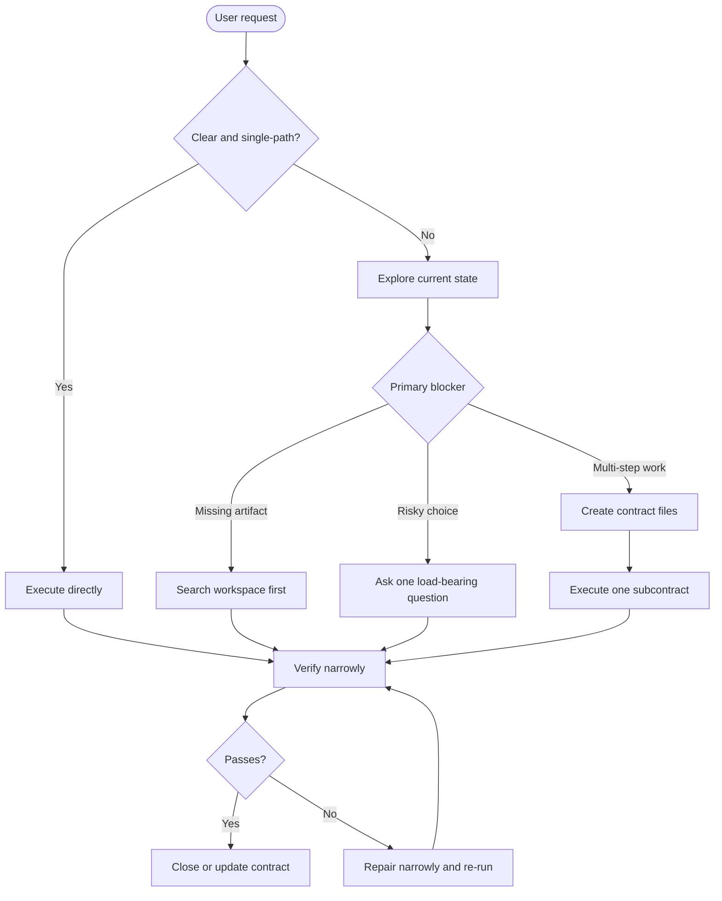

# Socrates Contract Protocol

[](https://github.com/jiyeongjun/socrates-protocol/tags)
[](https://github.com/jiyeongjun/socrates-protocol/actions/workflows/test.yml)
[](./LICENSE)

[한국어](./README.ko.md)

A mutation skill for cases where the user and agent need an explicit contract before changing files, data, settings, external systems, or other user-visible state.

## What It Does

Socrates Contract stays out of the way when the request is already explicit, low-risk, and single-step. It steps in when the goal, scope, success criteria, protected surface, or decomposition would change the mutation.

Core behavior:

- clear low-risk request: execute directly and verify
- missing artifact or target: look in the workspace first, ask later
- high-risk unresolved work: ask the most safety-critical question first
- multiple valid mutation branches: align the macro contract before acting
- large goal: create `contract-index.md` and one file per subcontract
- successful completion: verify every subcontract, verify the macro contract, and close the contract files

Typical triggers:

- vague preference words like `elegant`, `clean`, `good`, `robust`
- API, schema, migration, auth, billing, deletion, or production changes
- requests that still allow multiple materially different mutation paths
- renames of env vars, config keys, public APIs, or persisted fields
- tasks that require several clarification rounds, visible state tracking, or independently verifiable subgoals

## How It Flows

Socrates Contract is one router skill. It tries the lightest safe path first, then escalates to macro-contract and subcontract files only when the work needs durable alignment.



In short:

- clear request: do the work
- missing target: explore and search first, ask later
- risky change: stop and clarify the safety decision
- large goal: use `contract-index.md` and one file per subcontract
- after each subcontract: verify narrowly, repair if needed, then update the contract files

## Limitations

Socrates Contract still relies on model judgment to decide whether ambiguity is load-bearing. It is a risk-reduction aid, not a guarantee that every hidden constraint has been surfaced.

It is most effective when:

- high-risk signals are explicit in the prompt or visible in the code context
- the unresolved fork or missing constraint is textually grounded
- the user can answer a small number of concrete clarification questions
- durable contract state across turns is genuinely necessary for the same task

## Quick Install

These examples target release tag `v0.9.0`. If you are reading this worktree before that tag is pushed, run the checked-out repo's `scripts/install.mjs` directly. The current package version in this worktree is `0.9.0`.

The installer requires Node `24+`.

### Codex

Recommended global install:

```bash
VERSION=v0.9.0 && curl -fsSL https://raw.githubusercontent.com/jiyeongjun/socrates-protocol/$VERSION/scripts/install.mjs | SOCRATES_INSTALL_RUN=1 node --input-type=module - --platform codex --scope global --version "$VERSION"
```

Install into a repository:

```bash
VERSION=v0.9.0 && TARGET_REPO=/absolute/path/to/your/repo && curl -fsSL https://raw.githubusercontent.com/jiyeongjun/socrates-protocol/$VERSION/scripts/install.mjs | SOCRATES_INSTALL_RUN=1 node --input-type=module - --platform codex --scope repo --target-repo "$TARGET_REPO" --version "$VERSION"
```

Uninstall:

```bash
curl -fsSL https://raw.githubusercontent.com/jiyeongjun/socrates-protocol/v0.9.0/scripts/install.mjs | SOCRATES_INSTALL_RUN=1 node --input-type=module - --mode uninstall --platform codex --scope global
```

Codex install notes:

- global installs write the skill to `~/.codex/skills/socrates-contract`
- repo installs write the skill to `.agents/skills/socrates-contract`
- the generated `agents/openai.yaml` enables implicit invocation when the host supports it
- explicit `$socrates-contract` remains the most deterministic way to force the skill in Codex
- install reruns overwrite the Socrates Contract files managed by this installer

### Claude Code

Recommended global install:

```bash
VERSION=v0.9.0 && curl -fsSL https://raw.githubusercontent.com/jiyeongjun/socrates-protocol/$VERSION/scripts/install.mjs | SOCRATES_INSTALL_RUN=1 node --input-type=module - --platform claude --scope global --version "$VERSION"
```

Install into a repository:

```bash
VERSION=v0.9.0 && TARGET_REPO=/absolute/path/to/your/repo && curl -fsSL https://raw.githubusercontent.com/jiyeongjun/socrates-protocol/$VERSION/scripts/install.mjs | SOCRATES_INSTALL_RUN=1 node --input-type=module - --platform claude --scope repo --target-repo "$TARGET_REPO" --version "$VERSION"
```

Uninstall:

```bash
curl -fsSL https://raw.githubusercontent.com/jiyeongjun/socrates-protocol/v0.9.0/scripts/install.mjs | SOCRATES_INSTALL_RUN=1 node --input-type=module - --mode uninstall --platform claude --scope global
```

Claude install notes:

- global installs write the skill to `~/.claude/skills/socrates-contract`
- repo installs write the skill to `.claude/skills/socrates-contract`
- Claude-only Socrates subagents install to `.claude/agents/` or `~/.claude/agents/`
- explicit `/socrates-contract` remains the most deterministic way to force the skill in Claude Code or Claude CLI
- detailed on-demand guidance lives one level deep under `references/`
- role-based model guidance lives in `model-policy.json`
- install reruns overwrite the Socrates Contract files managed by this installer

## Versioning

Socrates Contract Protocol uses SemVer-style tags. The current release tag is `v0.9.0`; the current package version in this worktree is `0.9.0`.

- quick-install examples pin to the current release tag for reproducible installs
- `npm run verify:release-assets` checks the current worktree by default
- run `npm run verify:release-assets -- --ref v0.9.0` to confirm every installer asset exists in that release ref
- treat `0.x` releases as unstable contracts that may still change between minor versions
- `v0.9.0` keeps only contract-file state

## How Contract Files Work

Durable multi-step, protected-surface, or handoff-heavy work uses visible contract files. Narrow reversible edits can stay inline when they have one coherent verification path, even if they touch implementation plus tests or docs.

Socrates Contract proposes `contract-index.md` and `contracts/contract-NNN.md` when a goal needs durable handoff, protected-surface planning, unresolved decisions that must survive context loss, or several independent problems.

- The macro index lives at the workspace root by default.
- If an unrelated `contract-index.md` or `contracts/` directory already exists, Socrates should not overwrite it; it should ask one location or replacement question unless you already named a location.
- The index records the macro goal, progress, decisions, open questions, and each subcontract path.
- Subcontract files live under `contracts/` and contain the active task, inputs, completion criteria, mutation plan, verification, work log, and result.
- Only one subcontract should be active at a time.
- Before mutation, the active subcontract must be aligned or blocked on one explicit user question.
- After mutation, run the narrowest relevant verification first, repair if needed, and only then mark the subcontract `done`.
- Update `contract-index.md` whenever a subcontract becomes `done`, `blocked`, or materially changes scope.
- Close the macro contract only after every subcontract is `done` and the macro success criteria are verified.
- Contract files are visible user-agent state, not hidden task management.

## Representative Interactions

```text
$socrates-contract "write a JavaScript function sum(numbers) that returns 0 for an empty array"
# Execute directly. Do not create contract files.
```

```text
$socrates-contract "Design the account deletion API for our production SaaS. It must be GDPR-compliant and safe."
# Draft the macro goal, protected surfaces, success criteria, and first load-bearing question.
# After alignment, create contract-index.md and contracts/contract-001.md for the first bounded problem.
```

```text
$socrates-contract "show the current contract"
# Read contract-index.md and the active subcontract, then report progress and blockers.
```

```text
$socrates-contract "close the contract"
# Verify all subcontracts and the macro success criteria before closing.
# If the task stopped incomplete, leave the visible contract files for handoff.
```
